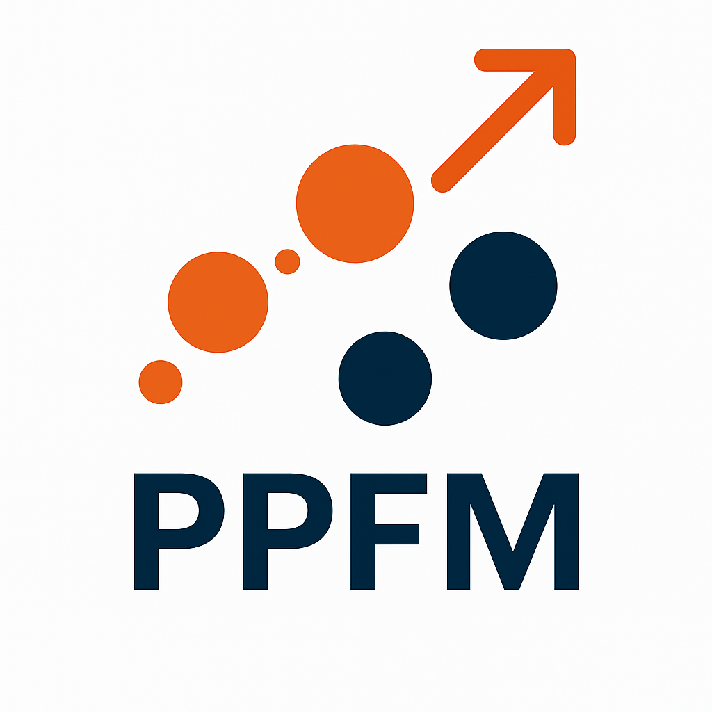

  

<h1 align="center"> Plasma Properties For Many </h1>

## License

This project is licensed under the Creative Commons Attribution 4.0 International License (CC BY 4.0).

<a href="https://creativecommons.org/licenses/by/4.0/">
PPFM © 2025 by Emanuele Ghedini, Alberto Vagnoni (University of Bologna, Italy)
</a> is licensed under 
<a href="https://creativecommons.org/licenses/by/4.0/">
Creative Commons Attribution 4.0 International
</a>

