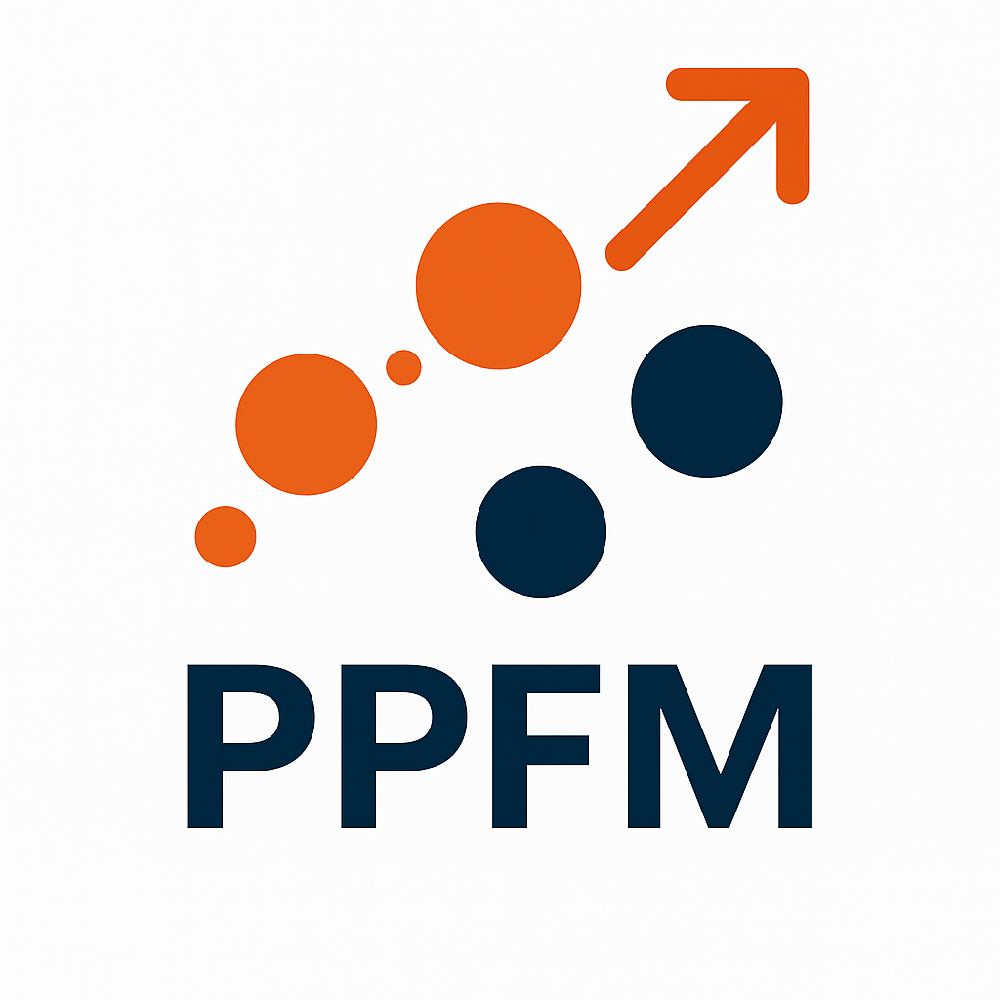

<p align="center">
  
</p>

<h1 align="center"> Plasma Properties For Many </h1>

**PPFM** is a modular and scalable tool designed in C++ for computing the thermodynamic and transport properties of complex plasma mixtures. 

**PPFM** can also compute and print : 

 - Species Partition Functions from spectroscopic data
 
 - Equilibrium and 2T composition
 
 - Thermodynamic LTE and NLTE 2T properties
 
 - Transport cross sections up to the 4th order (l=1..4) from interaction potentials and other data-sources.
 
 - Interaction collision integrals up to the 4th order needed for the Chapman-Enskog expansion (l=1..4 , s = l..2lmax-l)
 
 - Transport LTE and NLTE 2T properties.

The building is done using **CMake**.

## Setup

Start by **cloning this repository** the way you prefer from **git** or **integrated IDE supports**.

## Prerequisites

Before building PPFM, **ensure the following tools are installed** on your system.

### 🐧 Ubuntu / Linux

Install required tools via terminal through the following command lines:

```bash
sudo apt update
sudo apt install g++ cmake ninja-build libcurl4-openssl-dev libomp-dev python3
```

to verify installations you can always type 
```bash
toolName --version
```

on your terminal.

### 🪟 Windows (much more painful)

1. Install **Microsoft Visual Studio Build Tools** from: https://visualstudio.microsoft.com/visual-cpp-build-tools/ .
1. a) Double-click on program installer and go for MSVC install,
1. b) **CHECK** Desktop development with C++
1. c) **CHECK** From the bar appearing to the right of the installer window : 
    - MSVC Latest Version available
    - Windows 10 SDK if you use Windows 10, 11 for Windows 11, both if you don't know. For Windows 7, Xp and previouses just close the PC and go walking outside questioning yourself about your life choices.
    - C++ CMake Tools for Windows (very important)
    - Reboot the PC.
2. Download and install Python 3.xx from https://www.python.org/downloads/windows/ . 
  - When installing **CHECK** **"Add Python to Path"** (very important)
3. (I think this is not mandatory but try if the program won't work without). Install Ninja, download a zip (recommended) from here: https://github.com/ninja-build/ninja/releases and place it in a folder where you're sure it won't be deleted (write down the folder path).
  - Add Ninja to path by pressing Win+R then digit SystemPropertiesAdvanced, go to "Ambient variables" and click on "System variables". Find a voice named path, click on it then on modify. Now add C:\YourPersonalPathTo\Ninja

## Running a calculation

To run a calculation edit your own main.cpp file in the main folder of the program. There are some demo mainfiles to try in the demo folder, just substitute and rename the main.cpp with the desired demo file. Data required for the demo are provided. Please, ask the author for more data or to compute them from common data sources.

## Build Instructions

Building and launching can be done through terminal command line in the main folder of the program (where the main.cpp file is).  

### 🐧 Ubuntu / Linux - command line

To build, just prompt the following commands into a terminal while on .../yourPathTo/PPFM$ :

```bash
cmake -B build -S .
cmake --build build
```

And to execute :

```bash
./rooster
```

### ⌨️ Ubuntu / Linux - IDE !

IDE that supports CMake can be used to build, execute and debug the code much easier! Development and testing has been carried out through **VisualStudio Code** with **CMake, C++ and Python extension** installed. 
VScode extensions usually don't install things on your PC, they just tell Code how to behave in some cases. So, remember to satisfy prerequisites for Ubuntu described before. 
Building, and, Release and Debug activities can be run through the cmake toolbar appearing in below the VScode GUI.  

### 🪟 Windows - command line

1. After installing Visual Studio you'll be able to find **Developer Command Prompt for VS** searching for it in the Win menù.
2. Place yourself in the project main directory by calling:
  - ```bash cd C:\YourPersonalPathTo\PPFM ```
3. Configure (just the first time, minor modifications can usually simply re-build) with the command:
  - ```bash cmake -B build -S . ```
4. Build with the command:
  - ```bash cmake --build build ```
5. rooster.exe will be created in the mainfolder, just double-click on it.

### 🪟 Windows - IDE
The same configuration of VScode used for Linux came very handy in addressing the code compiling and execution. Unfortunally, debugging is still disabled. If you're used in working on debugging you should be able to implement your personal launch.json and properties.json and run debug sessions yourself.

If you familiar with Windows development and want to improve PPFM capabilities please contact me I'll be truly grateful.

Remember, your favourite IDE has to support CMake to run the program.

## 📂 Directory Structure

For being in its very first release PPFM handle data paths by hard-coding them into strings. Further Development will see better data handling. 
Please, do not rename any existing folder, do whatever inside the out/ folder for further data processing. PPFM also include routines to sistematically print data in desired folders. Check demo mainArH2.cpp for an example. 

```text
PPFM/
├── src/              # Source code (.h/.cpp) + 1 python .py script 
  ├── src/alglib/     # Internal Alglib static library
├── data/             # Input CSV data
  ├──Collision_Integrals 
  ├──Differential_Cross_Sections
  ├──Electronic_Configurations
  ├──Momentum_Transfer_Cross_Section
  ├──Partition_Functions
  ├──Phase_Shifts
├── demo/             # Some main.cpp files for demo running
├── build/            # Build directory (ignored by git)
├── CMakeLists.txt    # Project configuration
├── main.cpp          # The current environment for users. 
├── README.md
```

## Author disclaimer

I'm proud of this project but it is still full of flaws due to flaws in my education and skills, so please read carefully the followings.

Basically, PPFM saw light to gather toghether ab-initio calculation routines for facing this painful problem of determining plasma transport properties. That is, to the author knowledge, it is the only tool up to date that actually include routines to compute deflection angles, transport cross sections and collision integrals required for the Chapman-Enskog approximation. 

If you're just interested in computed properties for your particular case, I'm sorry to disappoint you but you won't find other data apart from those used for demos. 
For now. 
BUT, PPFM offers the most scalable and powerful environment to compute them from data gathered from the scientific literature or many different data-sources, do not surrender here! Computing Transport Properties for plasmas is complex but its' never been this easy either!

AND, if you're interested in: computed properties, collaborating, PPFM development, becoming a developer, helping, sharing knowledge or you have any kind of questions related to this work, please contact me, I'll be very keen to help.

alberto.vagnoni3@unibo.it
albertovagnoni97@gmail.com

## License

This project is licensed under the MIT License.

© 2025 Alberto Vagnoni, Emanuele Ghedini, Matteo Gherardi
Alma Mater Studiorum – Università di Bologna

See the [LICENSE](./LICENSE) file for details.

